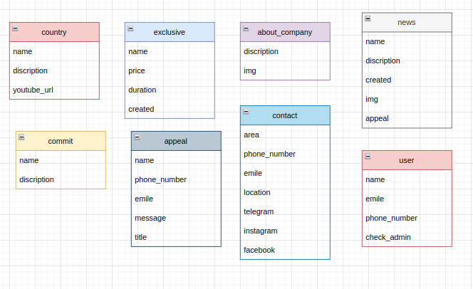

# tour

# Base url : <a href="https://tourbackend.pythonanywhere.com"> `https://tourbackend.pythonanywhere.com/`</a>

<!--# Base Documentations : <a href = 'https://tourbackend.pythonanywhere.com/api/vi/swagger/'>`https://tourbackend.pythonanywhere.com/api/vi/swagger/`</a>-->

# Data base img



# <div id="home">Paths</div>
## - <a href="#1">Country paths</a>
## - <a href="#2">About_company paths</a>
## - <a href="#3">Appeal paths</a>
## - <a href="#4">Commit paths</a>
## - <a href="#5">Contact paths</a>
## - <a href="#6">Exclusive paths</a>
## - <a href="#7">Home paths</a>
## - <a href="#8">Search paths</a>


## <div id="1">Country paths</div>

| Method | Path | Description |
| ------ | ------ | ------ |
| GET | `country_list/` | List of countries |
| POST | `country_create/` | Create a country |
| GET | `country_detail/<int:pk>/` | Detail of a country |
| POST | `country_update/<int:pk>/` | Update a country |
| DELETE | `country_delete/<int:pk>/` | Delete a country |

### <a href="#home">top of page</a>

### Example of country

#### country_list

```json
    input: 
    get request

    output:
    [
        {
            "id": int,
            "name": string,
            "discription": string,
            "youtube_url": string
        },
        {
            "id": int,
            "name": string,
            "discription": string,
            "youtube_url": string
        },
    ]
```

### <a href="#home">top of page</a>
 
#### country_detail

```json
    input:
    get request by id(required)

    output:
    {
        "id": int,
        "name": string,
        "discription": string,
        "youtube_url": string
    }
```

### <a href="#home">top of page</a>
 
#### country_create

```json
    input:
    post request by data(required)
    data = {
            "name": string,
            "discription": string,
            "youtube_url": string
        }
    output:
    {
        "id": int,
        "name": string,
        "discription": string,
        "youtube_url": string
    }
```

### <a href="#home">top of page</a>
 
#### country_update

```json
    input: id(required) by data (optional)
    data = {
        "name": string,
        "discription": string,
        "youtube_url": string
    }
    
    output:
    {
        "id": int,
        "name": string,
        "discription": string,
        "youtube_url": string
    }
```

### <a href="#home">top of page</a>
 
#### country_delete

```json
    input: id (required)

    output:
    {
        "message": "Deleted"
    }
```

### <a href="#home">top of page</a>
 
## <div id="2">About_company paths</div>

| Method | Path | Description |
| ------ | ------ | ------ |
| GET | `about_company_list/` | List of about_companys |
| POST | `about_company_create/` | Create a about_company |
| GET | `about_company_detail/<int:pk>/` | Detail of a about_company |
| POST | `about_company_update/<int:pk>/` | Update a about_company |
| POST | `about_company_delete/<int:pk>/` | Delete a about_company |

### <a href="#home">top of page</a>
 
### Example of about_company

#### about_company_list

```json
    input: 
    get request

    output:
    [
        {
            "id": int,
            "discription": string,
            "img": string
        },
        {
            "id": int,
            "discription": string,
            "img": string
        },
    ]
```

### <a href="#home">top of page</a>
 
#### about_company_detail

```json
    input:
    get request by id(required)

    output:
    {
        "id": int,
        "discription": string,
        "img": string
    }
```

### <a href="#home">top of page</a>
 
#### about_company_create

```json
    input:
    post request by data(required)
    data = {
            "discription": string,
            "img": string
        }
    output:
    {
        "id": int,
        "discription": string,
        "img": string
    }
```

### <a href="#home">top of page</a>
 
#### about_company_update

```json
    input: id(required) by data (optional)
    data = {
        "discription": string,
        "img": string
    }
    
    output:
    {
        "id": int,
        "discription": string,
        "img": string
    }
```

### <a href="#home">top of page</a>
 
#### about_company_delete

```json
    input: id (required)

    output:
    {
        "message": "Deleted"
    }
```

### <a href="#home">top of page</a>
 
## <div id="3">Appeal paths</div>

| Method | Path | Description |
| ------ | ------ | ------ |
| GET | `appeal_list/` | List of appeals |
| POST | `appeal_create/` | Create a appeal |
| GET | `appeal_detail/<int:pk>/` | Detail of a appeal |
| POST | `appeal_update/<int:pk>/` | Update a appeal |
| POST | `appeal_delete/<int:pk>/` | Delete a appeal |

### <a href="#home">top of page</a>
 
### Example of appeal

#### appeal_list

```json
    input: 
    get request

    output:
    [
        {
            "id": int,
            "name": string,
            "phone_number": string,
            "emile": string,
            "message": string,
            "title": string
        },
        {
            "id": int,
            "name": string,
            "phone_number": string,
            "emile": string,
            "message": string,
            "title": string
        },
    ]
```

### <a href="#home">top of page</a>
 
#### appeal_detail

```json
    input:
    get request by id(required)

    output:
    {
        "id": int,
        "name": string,
        "phone_number": string,
        "emile": string,
        "message": string,
        "title": string
    }
```

### <a href="#home">top of page</a>
 
#### appeal_create

```json
    input:
    post request by data(required)
    data = {
            "name": string,
            "phone_number": string,
            "emile": string,
            "message": string,
            "title": string
        }
    output:
    {
        "id": int,
        "name": string,
        "phone_number": string,
        "emile": string,
        "message": string,
        "title": string
    }
```

### <a href="#home">top of page</a>
 
#### appeal_update

```json
    input: id(required) by data (optional)
    data = {
        "name": string,
        "phone_number": string,
        "emile": string,
        "message": string,
        "title": string
    }
    
    output:
    {
        "id": int,
        "name": string,
        "phone_number": string,
        "emile": string,
        "message": string,
        "title": string
    }
```

### <a href="#home">top of page</a>
 
#### appeal_delete

```json
    input: id (required)

    output:
    {
        "message": "Deleted"
    }
```

### <a href="#home">top of page</a>
 
## <div id="4">Commit paths</div>

| Method | Path | Description |
| ------ | ------ | ------ |
| GET | `commit_list/` | List of commits |
| POST | `commit_create/` | Create a commit |
| GET | `commit_detail/<int:pk>/` | Detail of a commit |
| POST | `commit_update/<int:pk>/` | Update a commit |
| POST | `commit_delete/<int:pk>/` | Delete a commit |

### <a href="#home">top of page</a>
 
### Example of commit

#### commit_list

```json
    input: 
    get request

    output:
    [
        {
            "id": int,
            "name": string,
            "discription": string,
            "img": string
        },
        {
            "id": int,
            "name": string,
            "discription": string,
            "img": string
        },
    ]
```

### <a href="#home">top of page</a>
 
#### commit_detail

```json
    input:
    get request by id(required)

    output:
    {
        "id": int,
        "name": string,
        "discription": string,
        "img": string
    }
```

### <a href="#home">top of page</a>
 
#### commit_create

```json
    input:
    post request by data(required)
    data = {
            "name": string,
            "discription": string,
            "img": string
        }
    output:
    {
        "id": int,
        "name": string,
        "discription": string,
        "img": string
    }
```

### <a href="#home">top of page</a>
 
#### commit_update

```json
    input: id(required) by data (optional)
    data = {
        "name": string,
        "discription": string,
        "img": string
    }
    
    output:
    {
        "id": int,
        "name": string,
        "discription": string,
        "img": string
    }
```

### <a href="#home">top of page</a>
 
#### commit_delete

```json
    input: id (required)

    output:
    {
        "message": "Deleted"
    }
```

### <a href="#home">top of page</a>
 
## <div id="5">Contact paths</div>

| Method | Path | Description |
| ------ | ------ | ------ |
| GET | `contact_list/` | List of contacts |
| POST | `contact_create/` | Create a contact |
| GET | `contact_detail/<int:pk>/` | Detail of a contact |
| POST | `contact_update/<int:pk>/` | Update a contact |
| POST | `contact_delete/<int:pk>/` | Delete a contact |

### <a href="#home">top of page</a>
 
### Example of contact

#### contact_list

```json
    input: 
    get request

    output:
    [
        {
            "id": int,
            "area": string,
            "phone_number": string,
            "emile": string,
            "location": string,
            "telegram": string,
            "instagram": string,
            "facebook": string
        },
        {
            "id": int,
            "area": string,
            "phone_number": string,
            "emile": string,
            "location": string,
            "telegram": string,
            "instagram": string,
            "facebook": string
        },
    ]
```

### <a href="#home">top of page</a>
 
#### contact_detail

```json
    input:
    get request by id(required)

    output:
    {
        "id": int,
        "area": string,
        "phone_number": string,
        "emile": string,
        "location": string,
        "telegram": string,
        "instagram": string,
        "facebook": string
    }
```

### <a href="#home">top of page</a>
 
#### contact_create

```json
    input:
    post request by data(required)
    data = {
            "area": string,
            "phone_number": string,
            "emile": string,
            "location": string,
            "telegram": string,
            "instagram": string,
            "facebook": string
        }
    output:
    {
        "id": int,
        "area": string,
        "phone_number": string,
        "emile": string,
        "location": string,
        "telegram": string,
        "instagram": string,
        "facebook": string
    }
```

### <a href="#home">top of page</a>
 
#### contact_update

```json
    input: id(required) by data (optional)
    data = {
        "area": string,
        "phone_number": string,
        "emile": string,
        "location": string,
        "telegram": string,
        "instagram": string,
        "facebook": string
    }
    
    output:
    {
        "id": int,
        "area": string,
        "phone_number": string,
        "emile": string,
        "location": string,
        "telegram": string,
        "instagram": string,
        "facebook": string
    }
```

### <a href="#home">top of page</a>
 
#### contact_delete

```json
    input: id (required)

    output:
    {
        "message": "Deleted"
    }
```

### <a href="#home">top of page</a>
 
## <div id="6">Exclusive paths</div>

| Method | Path | Description |
| ------ | ------ | ------ |
| GET | `exclusive_list/` | List of exclusives |
| POST | `exclusive_create/` | Create a exclusive |
| GET | `exclusive_detail/<int:pk>/` | Detail of a exclusive |
| POST | `exclusive_update/<int:pk>/` | Update a exclusive |
| POST | `exclusive_delete/<int:pk>/` | Delete a exclusive |

### <a href="#home">top of page</a>
 
### Example of exclusive

#### exclusive_list

```json
    input: 
    get request

    output:
    [
        {
            "id": int,
            "name": string,
            "price": string,
            "duration": string
        },
        {
            "id": int,
            "name": string,
            "price": string,
            "duration": string
        },
    ]
```

### <a href="#home">top of page</a>
 
#### exclusive_detail

```json
    input:
    get request by id(required)

    output:
    {
        "id": int,
        "name": string,
        "price": string,
        "duration": string
    }
```

### <a href="#home">top of page</a>
 
#### exclusive_create

```json
    input:
    post request by data(required)
    data = {
            "name": string,
            "price": string,
            "duration": int,
            "created":date
        }
    output:
    {
        "id": int,
        "name": string,
        "price": string,
        "duration": int,
        "created":date
    }
```

### <a href="#home">top of page</a>
 
#### exclusive_update

```json
    input: id(required) by data (optional)
    data = {
        "name": string,
        "price": string,
        "duration": int,
        "created":date
    }
    
    output:
    {
        "id": int,
        "name": string,
        "price": string,
        "duration": int,
        "created":date
    }
```

### <a href="#home">top of page</a>
 
#### exclusive_delete

```json
    input: id (required)

    output:
    {
        "message": "Deleted"
    }
```

### <a href="#home">top of page</a>
 
## <div id="7">Home paths</div>

| Method | Path | Description |
| ------ | ------ | ------ |
| GET | `home/` | Home page |

### <a href="#home">top of page</a>
 
### Example of home

#### home

```json
    input:
    get request

    output:
    {
        "countries": [],
        "exclusives": [],
        "about_companies": [],
        "news": [],
        "commits": [],
        "contacts": [],
    }
```

### <a href="#home">top of page</a>
 
## <div id="8">Search paths</div>

| Method | Path | Description |
| ------ | ------ | ------ |
| GET | `search/` | Search page |

### <a href="#home">top of page</a>
 
### Example of search

#### search

```json
    input:
    get request by query(required)

    output:
    {
        "exclusives": [],
    }
```

### <a href="#home">top of page</a>
 
